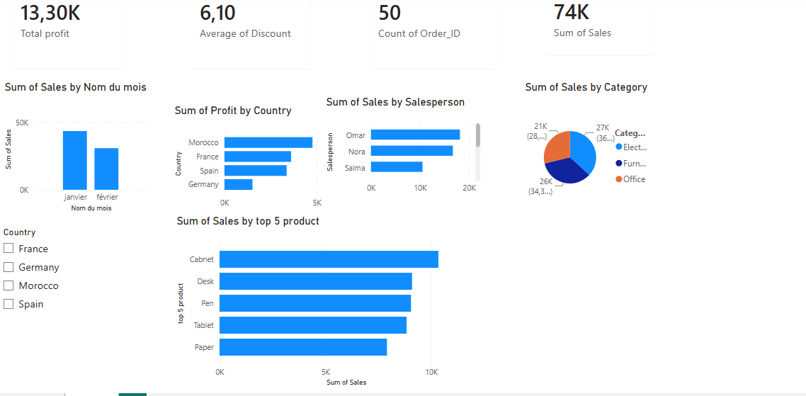

# 📊 Sales Dashboard – Power BI

## 📌 Project Overview

This project analyzes sales performance using Power BI.

The dashboard includes:

- Total Sales
- Total Profit
- Average Discount
- Number of Orders
- Sales by Month
- Profit by Country
- Sales by Salesperson
- Sales by Category
- Top 5 Products by Sales

---

## 🛠️ Tools Used

- Power BI
- Excel
- Data Cleaning
- Data Visualization

---

## 📂 Files

- 50 STAR.xlsx
- 50 st.pbix
- Dashboard.pdf

---

## 📷 Dashboard Preview

